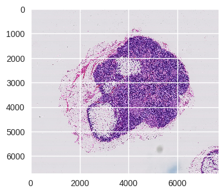

## Detect cancerous cells on pathology images with deep neural network
---
See the video where I explained my methodology: https://www.youtube.com/watch?v=H3RgC2ngo6g&feature=youtu.be

Tumor images obtained from https://camelyon16.grand-challenge.org/Data/ 

* Orginal Pathology image sample (a 'slide')  

* Cancerous region determined by pathologists marked in red  

* Sliding window approach to extract input patches for each slide  

* Patches with cancerous overlay (red regions are cancerous)   

* Model trained with transfer learning on 7 slides (model will improve greatly with more training data)  

* Predicted likelihood map (the reder reigion are more likely to be cancerous)  

